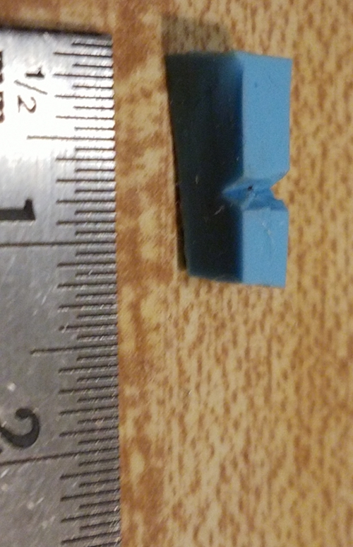
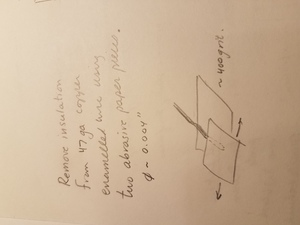
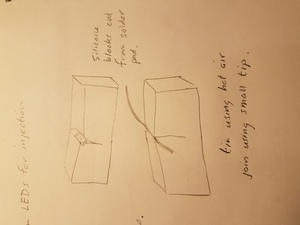
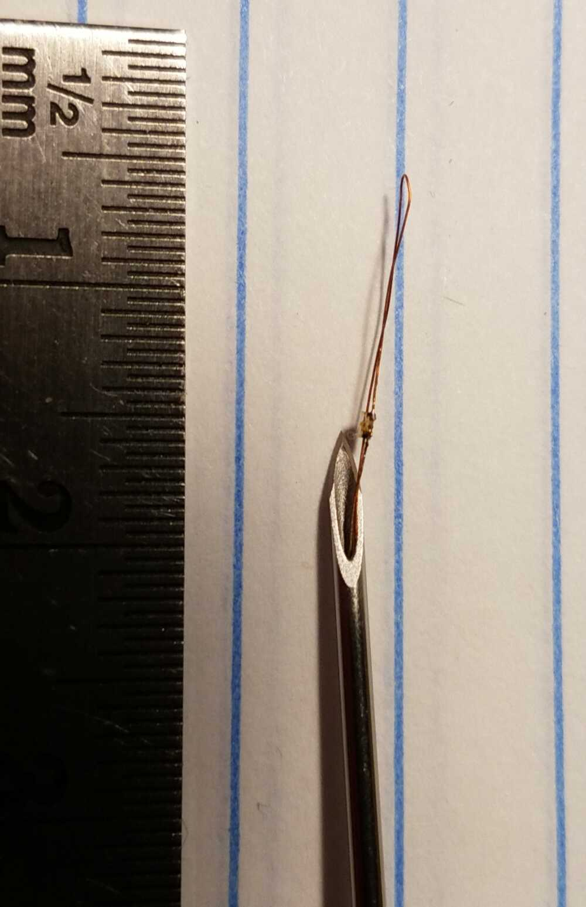

# Injecting light into vials.  

Worked on Barbara's vials, installing a red LED in one.  Here are some notes:
 * Used Dad's tiny manipulating tools and his microscope.
 * Made soldering jig from Oomoo25. Great idea, but need stiffer material.  Probably sacrifice a cooking utensil!
 * Soldering easier than expected.  Used small tip.  No extra flux.
 * inject with 1.2mm needle.   Pull LED and wires into needle from tip side.  When needle is inserted, push wires in, and withdraw needle.
 * 100 Ohm resistor in series gives approx 30mA, the maximum specced current for this LED. (0402, Digikey 732-11991-1).
 

### Before and after Christmas.

Put together a prototype ornament, making progress on soldering and placing LEDs in vials.

 * Remove insulation from thin enamalled wire using abrasive paper pieces.  About 400 grit works well.  Rub paper together, rotating wire between and abrading enamel.  This seems cleaner than burning.  Wire gauge is 47?  Diameter 0.004".  This is about what's needed since needle bore is ~ 1mm = 0.040"

 
 * As a clamp, use part of a silicone soldering mat from the HTMAA kit 2020.  this is stiffer than the oomoo25, and holds parts and wires for soldering.  Manipulate with tweezers under microscope.  A better rig could be made, allowing more controlled placement.  Use hot air rework tool from HTMAA kit soldering station for heating parts to tin with solder.  Then juxtapose and use small soldering tip to fuse the LED and wire together.  It works with some practice.  Not easy, but I can now solder a couple in an hour.

 * Here's a picture of LED soldered up and inserted into needle.
 
 
 
 * And a picture of the ornament
 
 
 
 * And a short [movie](./Ornament.mp4)
